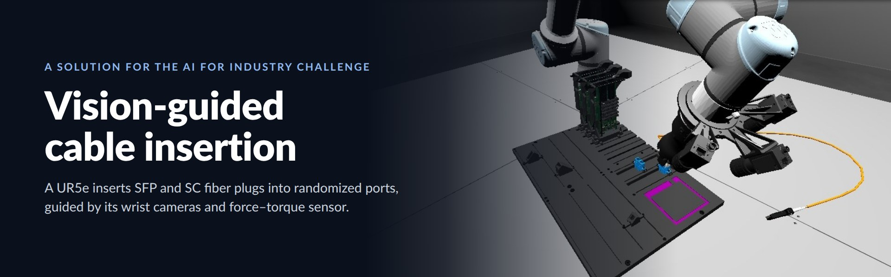
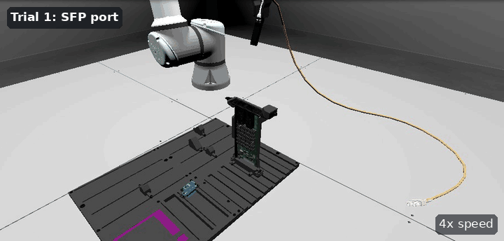
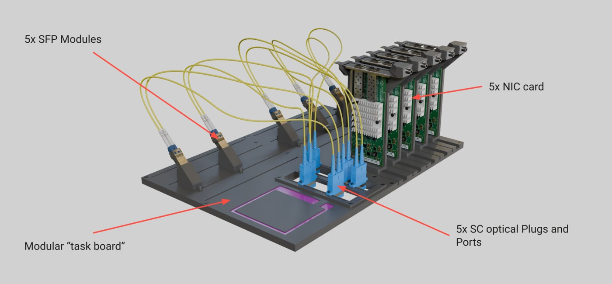
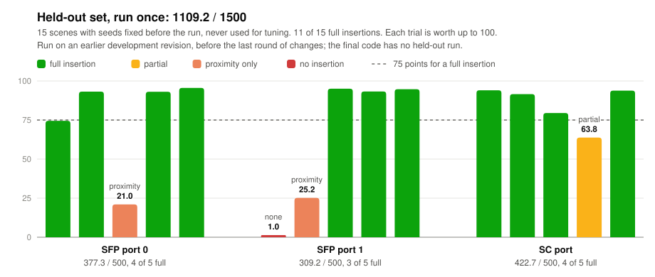
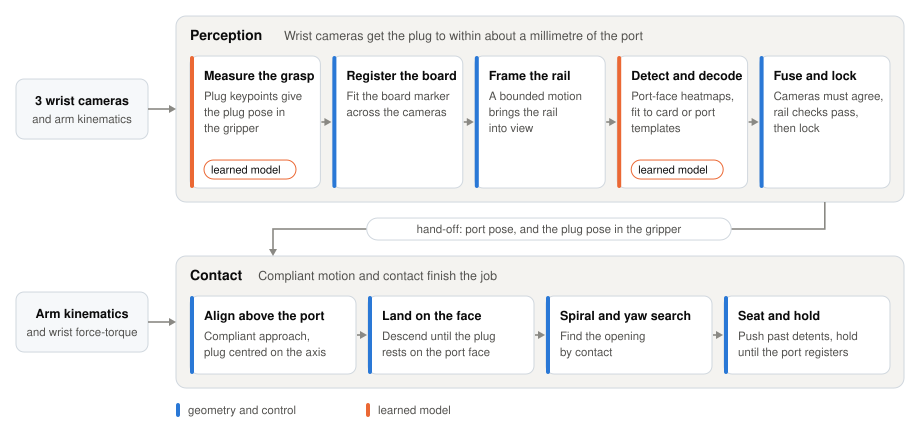
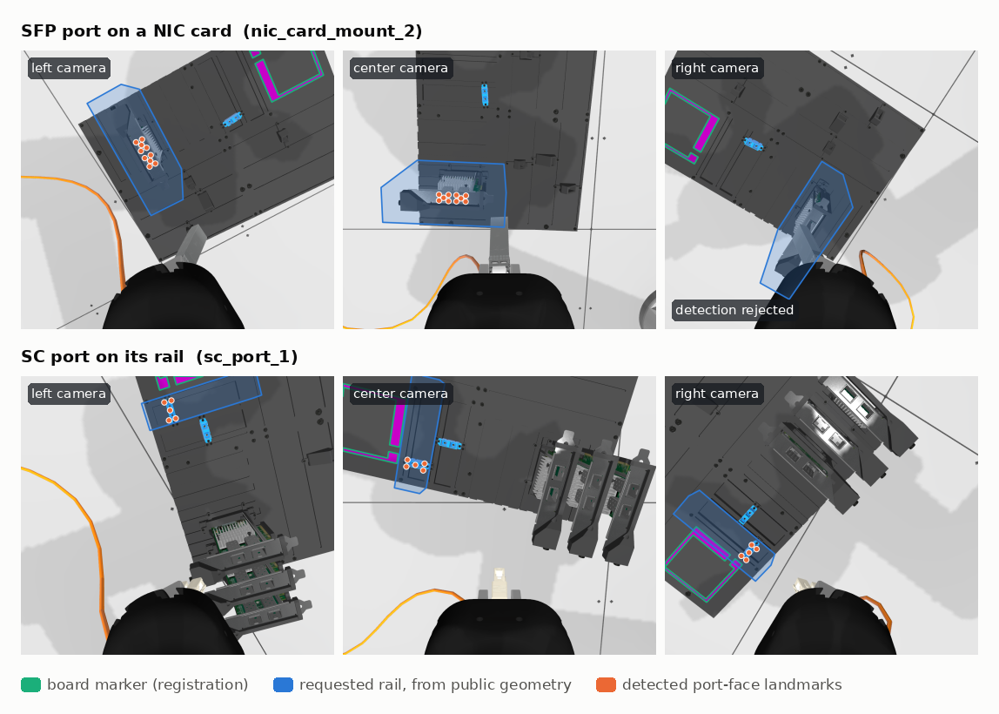
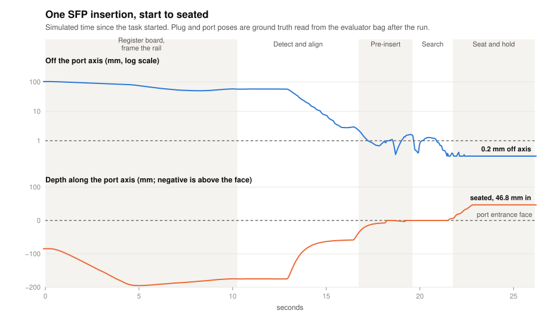

<p align="center">
  
</p>

<p align="center">
  <a href="https://github.com/pranay172/AI_for_Industry_Challenge/actions/workflows/tests.yml"></a>
  
  
  
  
</p>

<p align="center">
  <a href="#the-task">The task</a> ·
  <a href="#results">Results</a> ·
  <a href="#how-it-works">How it works</a> ·
  <a href="#things-i-learned-along-the-way">Lessons</a> ·
  <a href="#limitations-and-what-id-do-next">Limitations</a> ·
  <a href="#running-it">Running it</a> ·
  <a href="#where-my-code-is">Code map</a>
</p>

This is my solution to the qualification phase of the
[AI for Industry Challenge](https://www.intrinsic.ai/events/ai-for-industry-challenge),
an open robotics competition on autonomous fiber-optic cable insertion in a
randomized electronics-assembly workcell. It is built on the organizers'
[challenge toolkit](https://github.com/intrinsic-dev/aic). The toolkit's
history up to the qualification deadline is kept here, and my work is the
commit on top of it.

The task sounds simple: a robot arm holds a cable and plugs it in. The hard
part is the last millimetre. The port moves from trial to trial, the plug has
to arrive within about half a millimetre and a degree, the cable pulls on the
arm, and the only eyes are three wrist cameras whose view is partly blocked
by the gripper. My policy works from those cameras, the robot's joint states
and the wrist force-torque sensor. It never reads ground truth at runtime, and
it runs as the toolkit's ROS 2 Lifecycle node, `aic_model`.

### Demo: the official graded configuration

<p align="center">
  
  <br>
  <sub><em>These are the exact three scenes the organizers used to grade the qualification leaderboard,
  released after the deadline as
  <a href="https://github.com/intrinsic-dev/aic/blob/749f385b8343388bd01ca9a91bb5a6500d494a4e/aic_engine/config/eval_config.yaml"><code>eval_config.yaml</code></a>
  (<code>benchmarks/qualification.yaml</code> here). All three insertions are full, scoring 284.7 / 300. Shown at 4× speed.</em></sub>
</p>

The run in the GIF is my own, on my machine. It used the organizers'
evaluator image and an image built from this repository, with a view-only
Gazebo window attached for the recording. It is not a leaderboard result. It
is the better of two recorded runs; the other scored 229.5, losing the SC
trial at the port's detent (see [Results](#results)).

## The task

In each trial a UR5e starts out holding one end of an SFP–SC cable. It has to
insert the plug into either an SFP port on a NIC card or an SC optical port on
the task board.

<p align="center">
  
  <br>
  <sub><em>The task board and its parts. Image from the organizers' challenge toolkit.</em></sub>
</p>

- **Changes every trial:** the board pose, which rails hold NIC cards, where
  parts sit along their rails, card yaw, and the target port.
- **The policy sees:** three wrist cameras, joint states and the wrist
  force-torque sensor. It never sees ground-truth poses or the scene
  configuration.
- **Scoring:** up to 100 per trial. A full insertion gives 75 (a partial one
  up to 50, proximity up to 25), smooth, quick and efficient motion up to 24,
  and a valid model 1; excessive force and off-limit contacts are penalized
  ([details](docs/scoring.md)).

## Results

I've tried to report these the way I'd want to read someone else's: what was
measured, on which code, and where the numbers flatter me. Every score is an
official evaluator total from my own runs of the organizers' evaluator.

**The final code** (my submission image, and images built from this repository):

| Set | Result |
|---|---|
| Submission image, official graded config, 3 runs | 286.0 / 190.1 / 255.7 (mean 244.0); 7/9 full |
| Images built from this repository, official graded config, 3 runs | 284.7 (3/3 full, the demo), 255.3 and 229.5 (2/3 full each) |

**Earlier development revisions:**

| Set | Result |
|---|---|
| Held-out set: 15 scenes, fixed in advance, run once | **1109.2 / 1500**, 11/15 full |
| Official graded config, 5 runs without an evaluator reset race | 276.7–286.2 per run, 3/3 full each |
| The toolkit's `sample_config.yaml` | 282.0 / 300, 3/3 full |
| Wide board-pose scenes I generated (22) | 1450.0 / 2200, 14/22 full; target found in 20/22 |

<picture>
  <source media="(prefers-color-scheme: dark)" srcset="docs/assets/heldout-dark.svg">
  
</picture>

How I read these:
- **The held-out set is the most honest number, but it isn't the final
  code.** I fixed its 15 scenes before running them, ran them once and changed
  nothing in response. That run was on a development revision from before the
  last round of work: the wider card search and retrained detectors, the
  pre-insert handover, the start-pose return and the grasp measurement. Those
  scenes are spent now, so the final code has no clean held-out number.
- **The official scenes flatter me.** I tuned against them during development,
  so ~280 / 300 there and 1109.2 / 1500 (about 74%) on unseen scenes is the
  gap to keep in mind.
- **Most of the remaining losses start with the evaluator.** In the
  submission-image check, every trial that started from the home pose was a
  full insertion. Both losses came after the evaluator started a trial with
  the arm away from home. Images built from this repository also lost the SC
  trial twice on a normal start, at the port's detent, though neither run was
  under exact evaluation conditions (see
  [Limitations](#limitations-and-what-id-do-next)).

More detail, including every run, is in
[Training and evaluation](docs/solution/evaluation.md#results).

## How it works

I split the problem in two. The insertion tolerance is about half a
millimetre and a degree, and the wrist cameras get the plug to within about a
millimetre. Rather than chase the last half-millimetre with vision, I let the
plug land on the port face and feel for the opening.

<picture>
  <source media="(prefers-color-scheme: dark)" srcset="docs/assets/pipeline-dark.svg">
  
</picture>

1. **Start from a known place.** If the evaluator starts a trial with the arm
   away from home, the policy first returns to the start pose. Then keypoints
   on the plug, seen by the wrist cameras, give the plug's pose in the
   gripper; a trial that starts mid-reset can leave the plug shifted.
2. **Register the board.** I fit the task board's marker across the wrist
   cameras to get the board pose. Everything after that uses the public board
   geometry relative to this pose.
3. **Frame the requested rail.** A bounded camera motion brings the whole legal
   range of the target rail into view.
4. **Detect and decode the target.** Heatmap networks find the port faces. I
   then fit them to templates of the NIC card or SC port in the board frame,
   searching only placements the rail allows.
5. **Fuse across cameras.** The cameras must agree on the target, geometry and
   rail checks reject anything implausible, and the estimate locks once it is
   stable.
6. **Approach compliantly, then search by contact.** The arm aligns above the
   port and centres the plug, then lets it land on the face. A spiral and yaw
   search finds the opening, and the plug is seated, wiggled past detents and
   held until the port registers it.

### What the cameras see

<p align="center">
  
  <br>
  <sub><em>The shipped detectors replayed on wrist-camera images captured during a run. The board marker
  registers the board, the requested rail's envelope comes from public geometry, and the landmarks are what
  the detector and template decoder return. A camera whose detection fails the checks is left out of the
  fusion.</em></sub>
</p>

### One insertion, start to finish

<picture>
  <source media="(prefers-color-scheme: dark)" srcset="docs/assets/insertion-dark.svg">
  
</picture>

<sub><em>Trial 1 of the demo run. The plug and port poses are ground truth read from the evaluator's
recording after the run; the policy never sees them.</em></sub>

The details:
- [Perception](docs/solution/perception.md): board registration, rail framing,
  the SFP and SC decoders, fusion and grasp measurement.
- [Insertion](docs/solution/insertion.md): the phases, the cable-load handover,
  the face search, seating and the start-pose return.
- [Training and evaluation](docs/solution/evaluation.md): data collection,
  labelling, the shipped models, the benchmark runner, tests and results.

## Things I learned along the way

- **Read the engine, not just the spec.** The task-board description gives
  the NIC card travel as −21.5 to +23.4 mm. The engine doesn't enforce that,
  and its own sample configuration puts a card at +36 mm. My card search only
  covered the documented range, so a local check of my submission image on
  `sample_config.yaml` scored 3 / 300, with every trial ending
  `target_not_found`. Searching the mount's full physical travel and
  retraining the detectors on wider board poses took it to 282.0.
- **Check how each trial actually starts.** Some trials failed in ways I first
  blamed on my own code; one held-out "pre-insert stall" was among them. When
  I compared the first controller state of 109 recorded trial starts with the
  home pose, 12 of them, none the first trial of its run, had started 14–50 cm
  away, and all 12 had failed. The evaluator reactivates its controller before
  the arm's reset has taken effect, so the arm drives back toward the previous
  trial's pose and the cable is attached wherever the gripper ends up.
  Returning home and measuring the grasp now gets those trials back on track,
  but they still tend to end partial.
- **Force can't feel a light touch.** The wrist sensor reads about 21 N at
  rest, from the gripper and the cable, and a light press on the port face
  barely changes that. So the policy detects contact with the face by the
  plug no longer advancing, and keeps force for limits and aborts.
- **The cable pulls back.** Under the cable's load, the compliant arm can
  settle a few millimetres short of its goal, and no amount of centring moves
  it. A stiffer approach centred the plug better, but the cable then slid it
  off the face on the way down. What worked was handing over to the face
  search as soon as the residual stopped improving.
- **Fix a held-out set, run it once and leave it alone.** It's the only
  number here that I couldn't tune my way into, and the gap between it and
  the official scenes is the most useful thing it told me.

## Limitations and what I'd do next

- **Evaluator reset race.** The evaluator sometimes starts a trial before the
  arm has finished resetting, leaving it away from home with the plug shifted
  in the gripper. I return to the start pose and measure the new grasp, but
  such trials can still lose:
  - the return can be stopped by contact on the way;
  - shifted SFP grasps can catch a finger on the card mount at full depth;
  - shifted SC grasps can stop a few hundredths of a millimetre short of the
    port's contact sensor. A firmer SC press while holding the seat is the
    next thing I'd try; it is untested.
- **SC seating can stop at the port's detent.** In two of three runs of images
  built from this repository, the SC trial started normally, found the opening
  and then stopped 9–10.5 mm in, at the detent, scoring a partial insertion.
  Neither run had evaluation conditions: one had in-loop data capture on, the
  other had the demo viewer attached. The same scene was a full insertion in
  all three submission-image runs and in the other repository run, with the
  same weights, so it looks like run-to-run variation in getting past the
  detent. It is still a loss on a normal start.
- **SFP pre-insert stalls beyond 3.5 mm** under cable load, the face search's
  spiral radius, so the plug keeps re-centring until the timeout.
- **SFP targets on mounts 1–2 with the board near yaw −2.8** are not found
  (2 of 14 SFP scenes in my wide board-pose set), and framing a rail
  occasionally makes contact.
- **Qualification board only.** I built this for the qualification board,
  where `SC_PORT_0` is on `SC_RAIL_0` and `SC_PORT_1` is on `SC_RAIL_1`. Later
  toolkit versions change the SC port layout for phase 1, adding ports and
  moving `sc_port_1` to rail 0. My SC decoder does not support that layout.
- **No held-out number for the final code.** A fresh pre-registered set would
  be the first thing to run on it.

## Running it

The environment is managed with [pixi](https://pixi.sh); see the toolkit's
[getting-started guide](docs/getting_started.md).

**Submission image.** It bundles the four shipped checkpoints. Their training
and hashes are recorded in [benchmarks/models.json](benchmarks/models.json).

```bash
docker compose -f docker/docker-compose.yaml build model
```

**Running the policy directly.**

```bash
export AIC_SFP_DETECTOR_PATH=$PWD/aic_model/models/sfp_port_detector.pt
export AIC_SC_PORT_DETECTOR_PATH=$PWD/aic_model/models/sc_port_detector.pt
export AIC_PLUG_POSE_SFP_PATH=$PWD/aic_model/models/sfp_plug_pose.pt
export AIC_PLUG_POSE_SC_PATH=$PWD/aic_model/models/sc_plug_pose.pt
pixi run ros2 run aic_model aic_model --ros-args \
  -p use_sim_time:=true -p policy:=aic_model.policy
```

The simulator and scoring run in the organizers' `aic_eval` container. To
score a frozen copy of the policy against a scene configuration, I use the
benchmark runner (`scripts/benchmark.py`), described in
[Training and evaluation](docs/solution/evaluation.md).

**Tests.** The offline suite also runs in GitHub Actions on pushes to `main`
and on pull requests (`.github/workflows/tests.yml`).

```bash
pixi run python -m pytest tests
```

## Where my code is

My work is concentrated in `aic_model/`, plus `scripts/`, `tests/`,
`benchmarks/` and `docs/solution/`. [NOTICE](NOTICE) lists exactly what I
added and which toolkit files I changed.

```text
aic_model/aic_model/
  policy.py                 # Entry point: episode loop, start-pose return, grasp measurement
  policy_phases.py          # One control cycle per phase
  policy_insert.py          # Insert-phase contact handling
  face_search.py            # Spiral/yaw search, seating and dwell at the port
  policy_perception.py      # Target estimation, fusion and locking
  board_registration.py     # Board marker registration
  rail_view.py              # Bounded rail framing
  sfp_face_decoder.py       # SFP card template decoder
  sc_face_decoder.py        # SC port template decoder
  plug_pose.py              # Plug pose in the gripper
  policy_config.py          # Constants and per-connector settings
aic_model/models/           # Shipped checkpoints
aic_model/tools/, scripts/  # Scene generation, collection, labelling, training, export, benchmarking
scripts/figures/            # The README figures
scripts/demo/               # The demo recording
tests/                      # Offline tests
```

## Acknowledgements

Thanks to Intrinsic and the challenge organizers for the toolkit, the
simulation environment and the evaluation infrastructure this builds on.
Having a simulator, evaluator and scorer to work against meant my effort
could go into the problem itself. The task-board image is theirs,
from the toolkit's media. The toolkit's own documentation is in `docs/`;
start with the [qualification phase](docs/qualification_phase.md),
[scoring](docs/scoring.md) and [challenge rules](docs/challenge_rules.md).

## License

Apache License 2.0, the same as the toolkit (see [LICENSE](LICENSE) and
[NOTICE](NOTICE)). Files under `aic_utils/aic_isaac` are BSD-3-Clause.
